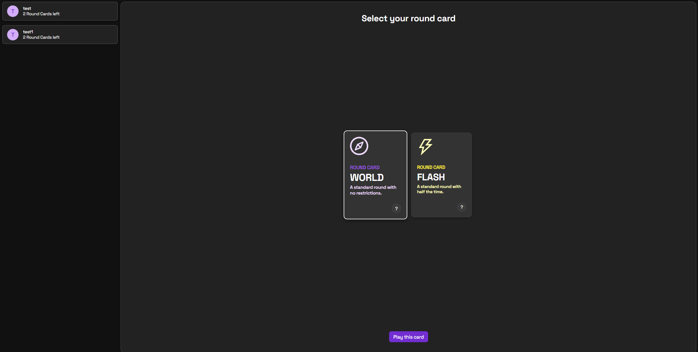
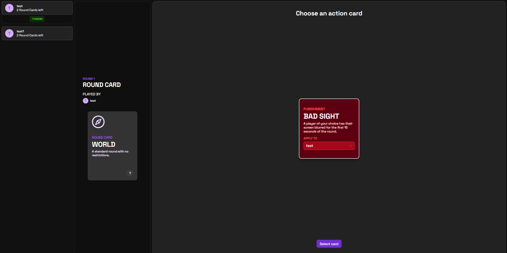
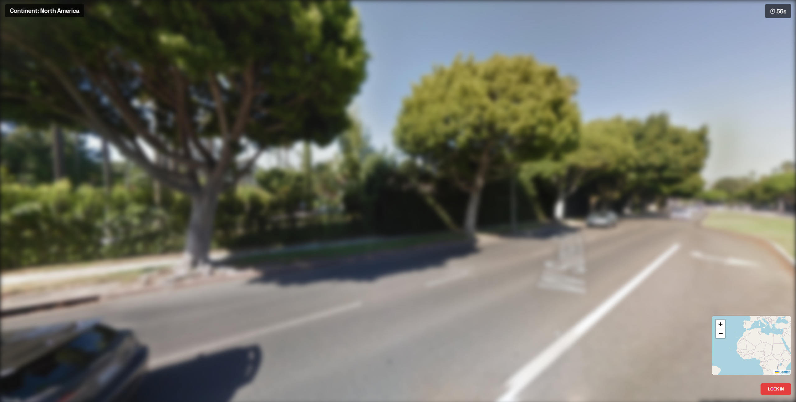
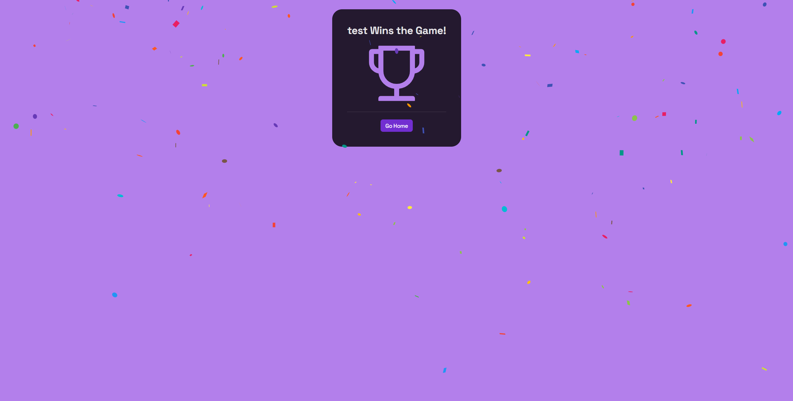
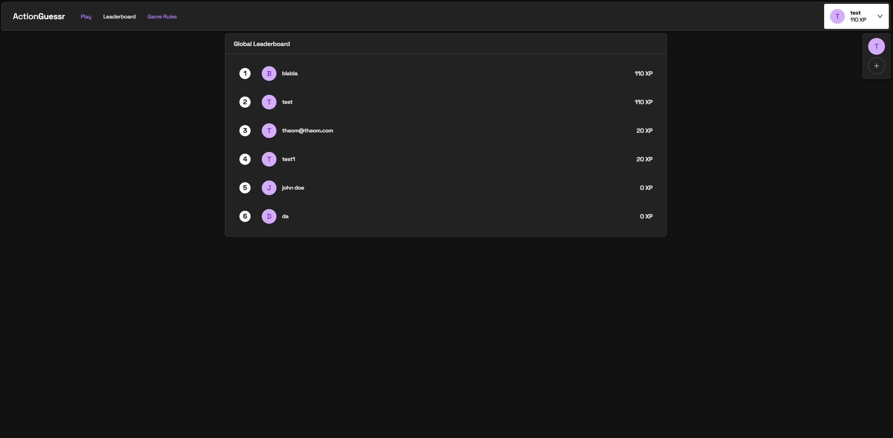

# Summary ActionGuessr

### Introduction

ActionGuessr is a turn-based game designed as an innovative and strategic enhancement of the popular game GeoGuessr. The motivation behind ActionGuessr is to introduce strategic depth and dynamic player interaction, enriching the original gameplay experience. To achieve this, we implemented a system of round cards that determine the unique conditions under which each round is played. Winning a round grants the player the right to choose the next round card. If the winner also happened to be the one who selected the round card for the previous round, they gain an additional advantage: they are allowed to discard that previously played round card. Players are also given action cards, which they strategically deploy either as beneficial power-ups for themselves or as tactical punishments targeting their opponents. The ultimate objective is to discard all round cards, with the first player to achieve this being declared the winner. This structure creates a captivating, engaging, and strategically rewarding gameplay experience beyond the original GeoGuessr concept.

### Technologies 

- Vercel: Platform for deployment and hosting that provides automated, continuous deployments integrated with GitHub, enabling easy and reliable deployment of Next.js applications.
- Next.js: React-based frontend framework that allows for server-side rendering, static site generation, and streamlined routing to build performant, scalable web applications.
- flake.nix: Provides reproducible and declarative package management, ensuring consistency across development environments through Nix's robust system.
- Node.js: JavaScript runtime environment essential for running the backend logic, facilitating backend operations, and handling asynchronous tasks efficiently.
- Docker: Containerization technology that ensures consistency and ease in managing dependencies and environments across development, testing, and production phases.
- Sockjs: JavaScript library ensuring reliable, cross-browser communication, emulating WebSockets with fallback options like HTTP polling.

### High-level components

#### Lobby Page
[Lobby Code](https://github.com/SoPra-FS25-Group-15/sopra-fs25-group-15-client/blob/main/app/(withNavigation)/lobbies/%5Bid%5D/page.tsx)
Manages player interactions, allowing users to create or join game sessions. It serves as the initial gathering point where players can organize and initiate gameplay.

#### Round Card Page
[Round Card Code](https://github.com/SoPra-FS25-Group-15/sopra-fs25-group-15-client/blob/main/app/(game)/games/%5Bcode%5D/roundcard/page.tsx)
Responsible for defining and managing the unique conditions under which each round is played. This page dynamically adjusts gameplay mechanics according to the drawn round card, providing diverse and engaging gameplay scenarios.

#### Action Card Page
[Action Card Code](https://github.com/SoPra-FS25-Group-15/sopra-fs25-group-15-client/blob/main/app/(game)/games/%5Bcode%5D/actioncard/page.tsx)
Facilitates strategic gameplay through action cards, which players can use either to gain advantages or impose tactical disadvantages on opponents. This component manages card selections, their effects, and interactions within the game flow.

#### Guessing Page
[Guessing Code](https://github.com/SoPra-FS25-Group-15/sopra-fs25-group-15-client/blob/main/app/components/game/guess.tsx)
Enables players to submit their location guesses based on provided clues or visual prompts. This component is critical as it directly impacts scoring and round outcomes.

#### Leaderboard Page
[Leaderboard Code](https://github.com/SoPra-FS25-Group-15/sopra-fs25-group-15-client/blob/main/app/(withNavigation)/leaderboard/page.tsx)
Displays and persistently stores the overall XP gained by playing the game. The leaderboard is crucial for motivating competition, providing transparency, and enhancing player engagement through visible progression.

### Launch & Deployement

#### Local Development
1. Clone the repository: ```git clone <repository-url>```
2. Navigate to the project directory: ```cd <project-directory>```
3. Install dependencies: ```npm install```
4. Run the application locally: ```npm run dev```

#### Run the tests
To run the tests, use: ```npm test```

#### Deployement
Deployment is automatic via Vercel upon pushing to the main branch.

### Illustrations

Players begin their journey by registering or logging into ActionGuessr. Once logged in, users can navigate to the "Play" section, where they create or join an existing lobby using a unique lobby code. The host initiates the game after all participants have joined and confirmed readiness.

The game progresses through several interactive stages:
1. Round Card Selection: At the start of the first round, a random player is selected to choose the round card, setting specific conditions and rules for the current round.

2. Action Card Phase: Players strategically select and deploy action cards, using these either to boost their own advantage or to disrupt opponents' gameplay.

3. Guessing Phase: Players submit their guesses regarding the location shown. Accuracy and speed are critical, impacting round outcomes significantly.

4. Results and Next Round: Upon submission of all guesses, players are redirected to a results page displaying round outcomes, points earned, and player standings.

5. Game Conclusion: Gameplay continues until a player successfully discards all of their round cards to win the game.

6. Leaderboard Review: After game completion, players can review and compare their accumulated experience points (XP) and rankings on the persistent leaderboard page.


### Roadmap

- Lobby Persistence: Ensure the lobby remains intact upon page reload.
- Player Statistics: Integrate frontend stats tracking games played and won.
- Enhanced Guessing Experience: Reveal correct locations only after all players submit guesses, with improved timer synchronization.

### Authors

Julien Zbinden, Flavia Röösli, Daria Stetsenko, Theodor Mattli, Zhenmei Hao and Tongxi Hu

### Aknowledgment

Thank you to our TA, Lucas Bär, who has been a great help in order to make this project work. Also a big thank you to the whole SoPra Team, who supported us in the process of developing this project and providing a great template.

### License

This project is licensed under the MIT License - see the [LICENSE.md](https://github.com/SoPra-FS25-Group-15/sopra-fs25-group-15-client/blob/main/license.md) file for details

